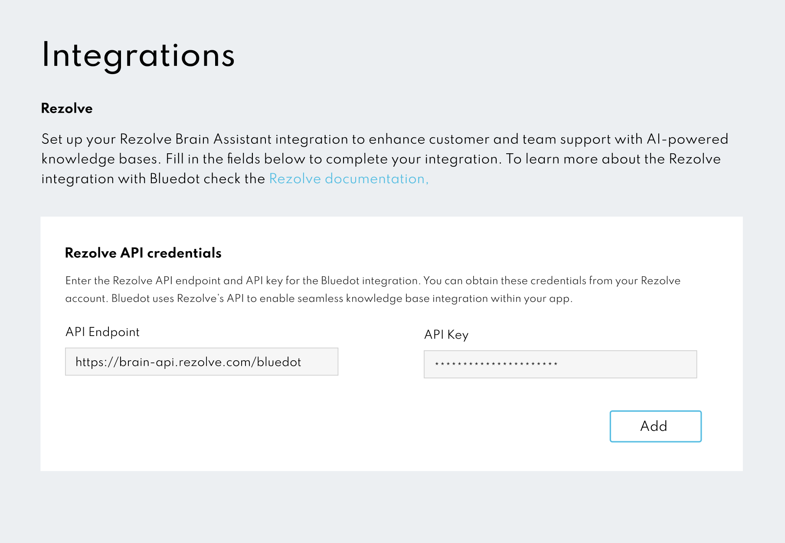

# Rezolve AI Integration

Rezolve’s AI platform specialises in conversational commerce, offering product-based recommendations and contextual data for a richer user experience. Once you set up this integration, your Bluedot-enabled app can request real-time commerce intelligence, stream dynamic responses, and incorporate product data into chat sessions.

---

## Prerequisites

1. **Rezolve AI Account**: Make sure you have an active Rezolve account and have access to your API Key and Endpoint. You can learn more at [Rezolve’s website](https://rezolve.com/).
2. **Admin Account**: You’ll need sufficient permissions in Canvas to manage integrations (e.g., Admin role).

---

## Setting Up Rezolve AI

Follow these steps to connect your Rezolve API Key and Endpoint:

1. **Log in to Canvas**
    
    Sign in to your Bluedot Canvas dashboard using your admin credentials.
    
2. **Navigate to Integrations**
    
    From the side menu, select **Integrations**. You’ll see a list of available third-party integrations.
    
3. **Select Rezolve**
    
    Locate **Rezolve** in the list. Click **Set Up** (or **Configure**) to open the setup screen.
    
4. **Enter Your Rezolve API Credentials**
    - **API Endpoint**: The base URL provided by Rezolve (e.g., `https://brain-api.rezolve.com/bluedot`).
    - **API Key**: Your unique key associated with the Rezolve account.
    

1. **Click “Add”**

    Once both fields are complete, click **Add**. Canvas will validate your credentials with Rezolve AI. If successful, you’ll see a confirmation message or status indicator showing that Rezolve AI is connected.
    

---

## Using Rezolve AI in Your App

After the integration is successful in Canvas, check out our [Quickstart](../Chat%20AI/Quick%20Start.md) guide to learn how to create a chat session, send messages, and display the real-time product contexts returned by Rezolve AI.