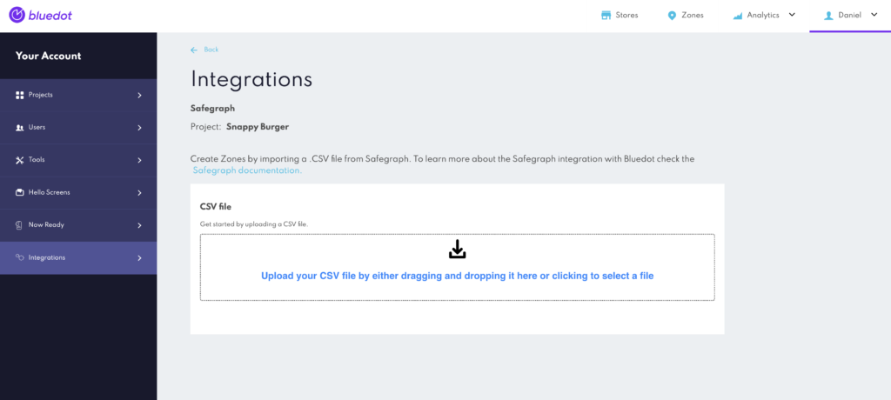

Safegraph Integration
=====================

Welcome to the documentation for the Rezolve and SafeGraph integration! This integration combines the exceptional accuracy of Rezolve's geofencing technology and SafeGraph’s comprehensive geospatial data to create a powerful, location-based solution.

This integration allows users to seamlessly import SafeGraph’s geospatial data into the Rezolve Canvas dashboard, creating highly accurate geofences. By incorporating SafeGraph’s extensive POI data, businesses can enhance their location-based services and deliver even more precise and engaging customer experiences.

This documentation will walk you through integrating SafeGraph’s data into the Rezolve platform, providing an efficient way to create geofences that accurately capture your target locations.

**Access Rezolve's platform and navigate to Integrations**: Log in to your Rezolve account and navigate to the main dashboard, then from the main menu locate the integrations section and then select SafeGraph from the available options.

**Upload SafeGraph CSV file**: Find the drag-and-drop input area, where you’ll be able to upload the SafeGraph CSV file containing the geospatial data you want to use for creating geofences.  

**Initiate geofence creation**: After uploading the CSV file, the platform will automatically begin creating geofences based on the SafeGraph data.

**Monitor import progress**: A table below the input area will display the progress of the geofence import, allowing you to keep track of the ongoing process.

**Confirm import completion**: Once the import is finished and all geofences have been created, the status of the job in the table will update to ‘_Complete’_.

By following these steps, you’ll be able to successfully import SafeGraph’s data into Rezolve's platform and create highly accurate geofences to enhance your location-based services.

Additional Features
-------------------

**Scale Polygon Size**: Users have the option to add an extra column to the SafeGraph CSV file with the header `SCALE_POLYGON`. This feature allows you to inflate or deflate the polygon shape by a specified percentage. For instance, inputting “5%” will increase the size of the polygon by 5%, while entering “-5%” will decrease its size by 5%. This flexibility enables users to create geofences that more accurately reflect their desired coverage areas, further enhancing the precision and effectiveness of location-based services.

By taking advantage of this additional feature, you can customise your geofences to better suit the specific needs of your business, ensuring a more tailored and relevant customer experience.

Important Notes
---------------

Here’s a list of important considerations to keep in mind when integrating SafeGraph data into Rezolve's Canvas dashboard to create geofences:

1.  **File size limitation**: The maximum file size for uploading a SafeGraph CSV file is 1GB. Ensure your file falls within this limit to avoid issues during the import process.
2.  **Polygon shapes only**: Rezolve's geofencing technology works specifically with polygon shapes. During the import process, only locations with a “_POLYGON_” shape will be used to create geofences. Other shapes present in the SafeGraph data will be ignored.
3.  **Minimum polygon area:** Polygons with an area smaller than 70 square meters will be ignored during the import process.
4.  **Valid polygon coordinates required:** Polygons with invalid coordinates will be ignored during the import process. Ensure your Safegraph data contains accurate and valid coordinates to create the geofences.
