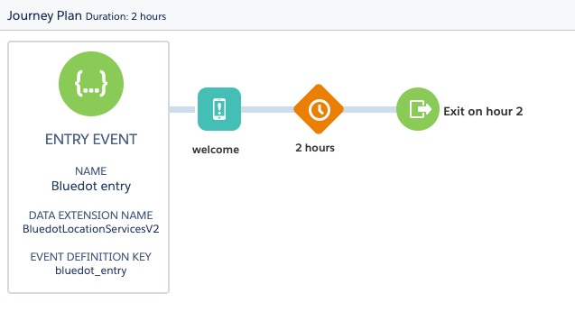
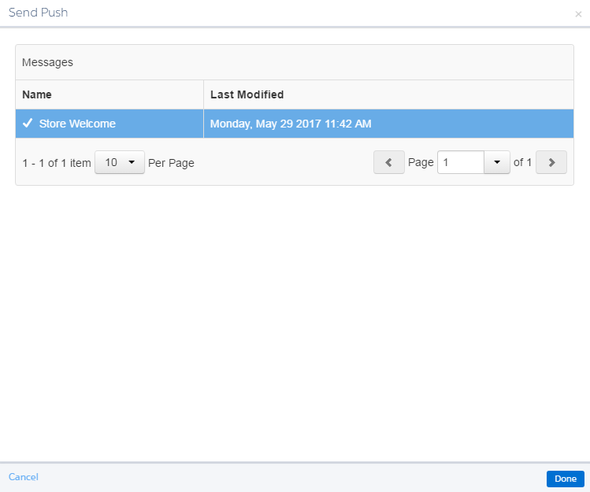

Journey Setup
=============

Once events have been correctly setup (see [**Event Creation**](./Create%20SFMC%20events.md) section), _Journeys_ can be created using those events as triggers.

*   Create a Trigger, triggered by Rezolve
*   Send a Location-Based Mobile Notification

Create a Trigger, triggered by Rezolve
--------------------------------------

1.  From the _Journey_, add an API Event as the entry source.

2.  Click on the API event to allow you to select from the available API events.

3.  Choose Bluedot Entry or Bluedot Exit as appropriate.

4.  Once selected, you can optionally choose to add a contact filter to only have a segment trigger this _Journey_.

5.  You can use any of the custom data defined in the Allowed Custom Data section above to segment based on, or any other Rezolve or other data.

6.  Once you’re finished with the event setup, you can configure your _Journey_ as normal – Bluedot event and custom data will be available for _Journey_ activities.

Send a Location-Based Mobile Notification
-----------------------------------------

A push notification is one of the actions that can be triggered by a Journey triggered by a user entering or exiting a Zone.

Create a mobile push notification
---------------------------------

1.  Under the **Mobile Studio** drop-down, select the **MobilePush** (If these are not available, contact your Salesforce Marketing Cloud representative to enable this functionality).
2.  Select the **Create Message** button.
3.  Select **Outbound**. The other options are only for when using standard geofence marketing, not the Hyper Location-enabled geofences that are available via Rezolve Location Marketing.
4.  Fill in the details of your message. For the send method, select **Interaction**.

5\. Now, create a Zone and Journey as [detailed in this guide](./Journey%20setup.md).

6\. When activating your Journey, add a **Send Push** action to the Journey. It will appear in grey.

 

7\. Select the **Send Push** icon in the Journey workflow and select **Configure.** A send Send Push pop up will appear. Select the message created in Step 4.

8\. The **Send Push** activity will now have turned cyan to indicate that it has been assigned.

9\. Make sure to **activate** your Journey once you are finished so that it can start interacting with your users!