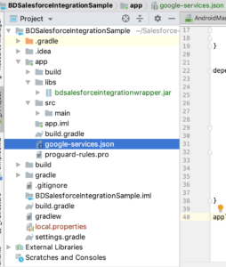

Salesforce Android Integration
==============================

Overview
--------

This documentation describes the steps required to integrate the Bluedot Point Android SDK and Marketing Cloud Android SDK into an Android App.

Salesforce Marketing Cloud Android SDK Integration
--------------------------------------------------

1\. Add the following repositories and dependencies to your Project’s `build.gradle` file:
```gradle
...
allprojects {
    repositories {
        maven { url "http://salesforce-marketingcloud.github.io/JB4A-SDK-Android/repository" }
    }
}
...
dependencies { 
    ...
    classpath 'com.google.gms:google-services:4.0.1'
}
```

2.  Add the following plugin and dependencies to your application’s `build.gradle` file:
```gradle
dependencies { 
    ... 
    implementation ('com.salesforce.marketingcloud:marketingcloudsdk:6.1.0') { 
         exclude module: 'play-services-location' //remove to use Geofence or Proximity messaging } 
    implementation 'com.google.android.gms:play-services-location:16.0.0'
    api 'com.google.firebase:firebase-messaging:17.4.0'
    api 'com.google.firebase:firebase-core:16.0.8'
}
apply plugin: 'com.google.gms.google-services'
```

3.  Add `google-services.json` obtained from Firebase test project in your app as below:



The following code example demonstrates starting the Marketing Cloud SDK as well as obtaining the `salesforceContactKey` or setting the`salesforceContactKey` if not assigned yet. More information on how to get AppID, Access Token and MID can be found [here](http://salesforce-marketingcloud.github.io/JB4A-SDK-Android/create-apps/create-apps-overview.html#finding-your-marketing-cloud-application-configuration-data)

```java
public class MainApplication extends Application implements MarketingCloudSdk.InitializationListener {
    private String salesforceContactKey;
    private String app_id="";           //From Marketing Cloud App details
    private String access_token="";     //From Marketing Cloud App details
    private String mID = “”;            // MID from Firebase setup
    private String fcm_id="";
    private void initCloudMobilePushSDK() {
        MarketingCloudSdk.init((this, MarketingCloudConfig.builder()
            .setApplicationId(app_id)
            .setAccessToken(access_token)
            .setSenderId(fcm_id)
            .setMarketingCloudServerUrl(getString(R.string.marketing_cloud_url))   //Cloud Marketing URL
            .setMid(mID)
            .setNotificationCustomizationOptions(
                        NotificationCustomizationOptions.create(R.mipmap.ic_launcher, null,
                              new com.salesforce.marketingcloud.notifications.NotificationManager.NotificationChannelIdProvider() {
                              @Override @NonNull 
                               public String getNotificationChannelId(@NonNull Context context,@NonNull NotificationMessage notificationMessage) {
                                     // Whatever custom logic required to determine which channel should be used for the message.
                                     return CHANNEL_ID;
                               }
                })).build((Context) this), this));
    }

@Override
public void complete(@NonNull InitializationStatus status) {

if (status.status() == InitializationStatus.Status.SUCCESS) {
    logInfo("Marketing Cloud SDK started");
    salesforceContactKey = MarketingCloudSdk.getInstance().getRegistrationManager().getContactKey();
    if (salesforceContactKey == null || salesforceContactKey.length() == 0) {
        salesforceContactKey = UUID.randomUUID().toString();
        MarketingCloudSdk.getInstance().getRegistrationManager().edit().setContactKey(salesforceContactKey).commit();
    }

    } else if (status.status() == InitializationStatus.Status.COMPLETED_WITH_DEGRADED_FUNCTIONALITY) {
        // While the SDK is usable, something happened during init that you should address.
       // This could include:

      //Google play services encountered a recoverable error

     /* The user had previously provided the location permission, but it has now been revoked.
     Geofence messages have been disabled. You will need to request the location
     permission again and re-enable Geofence messaging again. */

     /* Google Play Services attempted to update your SSL providers but failed. It should be assumed that
     all network communications will fallback to TLS1.0.
     */
     } else if (status.status() == InitializationStatus.Status.FAILED) {
         logInfo("Marketing Cloud SDK error: " + status.toString());
     } else {
         logInfo("Marketing Cloud SDK : Unknown error");
     }
   }
    ...
}
```

The full documentation on Marketing Cloud SDK integration; if required at any point; is available [here](https://salesforce-marketingcloud.github.io/JB4A-SDK-Android/sdk-implementation/implement-sdk-google.html).

Bluedot Point SDK Integration
-----------------------------

### Requirements

*   Minimum Android OS Version – 4.0 Ice Cream Sandwich (API 14) and above.
*   Active mobile data or a Wi-Fi connection.
*   Location services must be turned on with the device allowing location updates from both GPS and network.

### Pass Salesforce Marketing Cloud Contact Key into Bluedot

To trigger Bluedot events in Salesforce Marketing Cloud, please ensure that the Contact Key is passed into Bluedot via the `CustomKey` field with `ServiceManager.setCustomEventMetaData()`:

```java
@Override
public void onBlueDotPointServiceStartedSuccess() {
    mServiceManager.subscribeForApplicationNotification(this);
    Map<String, String> metaData = new HashMap<>();
    String salesforceContactKey = MarketingCloudSdk.getInstance().getRegistrationManager().getContactKey();
    metaData.put("ContactKey", salesforceContactKey);
    mServiceManager.setCustomEventMetaData(metaData);

    logInfo("BD SDK started & Contact Key set as "+salesforceContactKey);
 }
```


:::info
The custom event metadata is not persisted across SDK sessions. If the SDK is logged out the custom event metadata is cleared by the SDK. We suggest setting the custom data every time the SDK is authenticated in the app.

More information on best practices of setting and using custom event metadata can be found [here](../../../Custom%20Data.md).
:::

**GitHub Sample Project**
-------------------------

A sample project which demonstrates the integration of Marketing Cloud SDK and Bluedot Point SDK is available on **[GitHub](https://github.com/Bluedot-Innovation/Salesforce-Simple-Integration-Demo-Android)**.