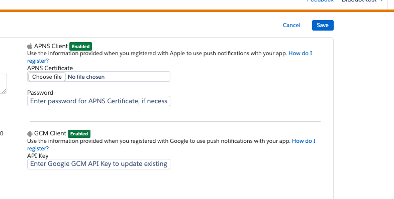

Integrate the Point SDK
=======================

### Integration Prerequisite

You’ll first need to integrate the Point SDK into your mobile app. You can find step-by-step integration guides here:

*   [Android integration](../../../Point%20SDK/Android/Overview.md)
*   [iOS integration](../../../Point%20SDK/iOS/Overview.md)

For most use cases, it’s also important to integrate the Journey Builder SDK. Detailed documentation is available here for [Android](http://salesforce-marketingcloud.github.io/JB4A-SDK-Android/) and [iOS](http://salesforce-marketingcloud.github.io/JB4A-SDK-iOS/).

To allow push capabilities to be available from Salesforce Marketing Cloud, add FCM ID obtained from your Firebase account to Salesforce Mobile Push Administration Page for the App.

Please refer to below screenshot for reference:

Integrating SDK to Android App
------------------------------

The SDK comes with the minimum requirements, which are needed to be satisfied for the SDK to start working, this means updating the AndroidManifest.xml file, which is the main configuration file of every Android project. Once this is done, the Salesforce Marketing Cloud Contact Key will need to be passed into the SDK to allow Rezolve triggers to be associated with the correct user profile – a detailed step by step guideline is available [here](../Mobile%20SDK%20Integration/Android.md).

Integrating SDK to iOS App
--------------------------

Once the SDK is integrated, the Salesforce Marketing Cloud Contact Key will need to be passed into the SDK to allow Rezolve triggers to be associated with the correct user profile – a detailed step by step guideline is available [here](../Mobile%20SDK%20Integration/Android.md).