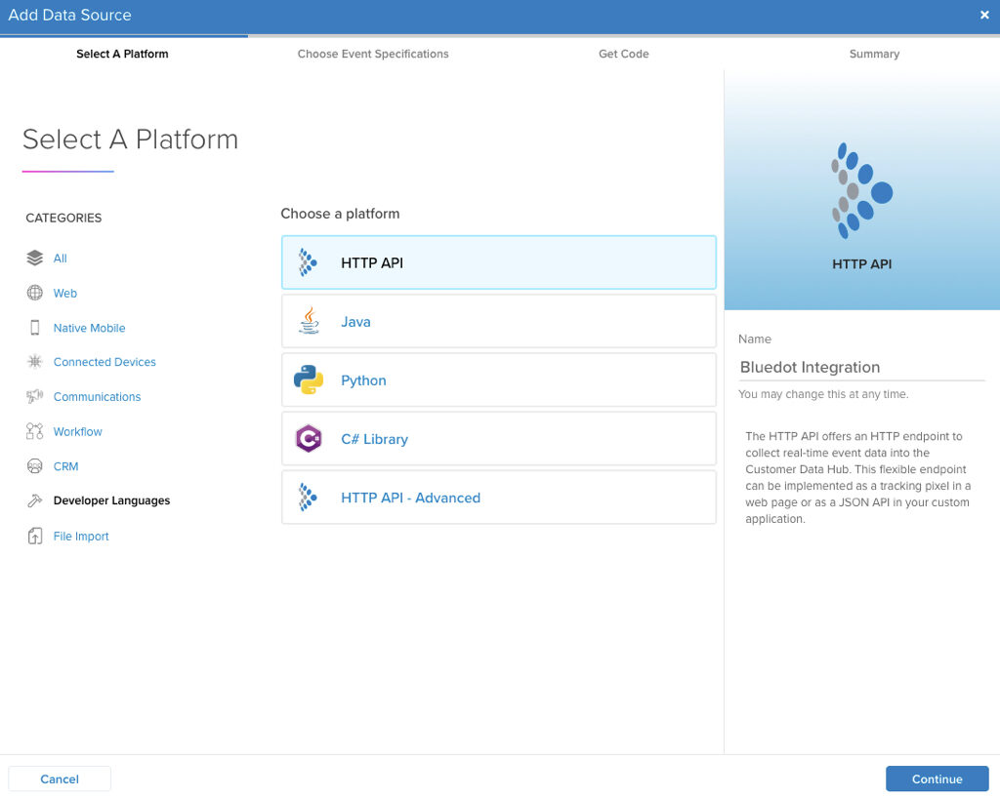
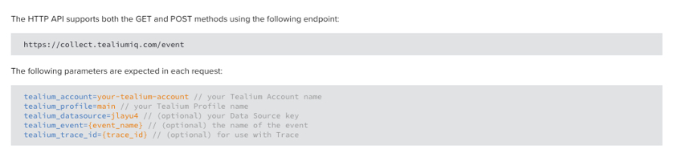
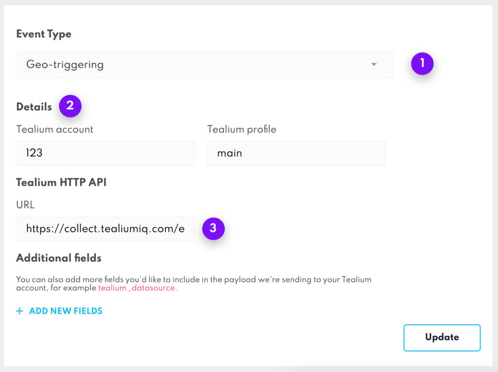

Tealium Integration
===================

Tealium is a customer data platform formed of EventStream, AudienceStream, and iQ Tag Management to integrate mobile, online, and alternative data from third-party sources. Combine the power of Tealium with the precision and scalability of Bluedot’s location services to accelerate growth, drive loyalty engagement and revenue in your app and beyond.

Bluedot setup
-------------

### Creating a new Project

Creating a Project is your first step. All your Zones exist within a Project. More information on adding and managing Bluedot Canvas project can be found [here](../Canvas/Creating%20a%20new%20project.md).

### Adding a Zone

You’ll need to create a **Zone** before you can start adding in specific **Geofeatures**. Each Zone can have one or many **Geofeatures** – that’s up to you and your use-case. More information on adding and managing Zones can be found [here](../Canvas/Add%20a%20new%20zone.md).

Tealium setup
-------------

From Tealium’s server-side dashboard, add a new Data Source.

### Add HTTP API Data Source

*   Select the HTTP API data source, give it a name and press continue
*   The Event Specifications are optional, you can skip this step for now

### Data Source values

*   From the _Get Code_ tab we’ll use the following parameters:
    *   Your assigned endpoint, in this example, is: https://collect.tealiumiq.com/event
    *   The `tealium_account` and `tealium_profile`
    *   The other fields are optional
*   You can also get these values later from the Data Source details

Click on the “Save and Continue” button.

We’ll use the previous parameters to start sending Bluedot events to Tealium. From Canvas, go to the Integrations section, select the Project you’d like to connect to Tealium and follow these steps:

**Steps**

**Description**

1\. Select event type

There are three types of events: Geo-triggering, Tempo and Wave. To learn more about the event types go to the [Webhooks documentation](../Webhooks/Overview.md)

2\. Fill required fields

 The following fields are required, you can get both of them from the Tealium’s Data Source details:

*   `Tealium account`

*   `Tealium profile`

3\. Tealium’s HTTP API URL

This is the URL that was assigned for the HTTP API data source, in this example the URL is https://collect.tealiumiq.com/event

Add optional fields

You can also add more fields that you’d like to include in the payload we’re sending to your Tealium account, an example of that is the `tealium_datasource`

Adding custom data through the SDK’s Custom Event Meta Data
-----------------------------------------------------------

The Custom Event Meta Data allows you to set additional event-specific data for the Bluedot SDK’s events. This is the method used to include additional information about the end-user, for example, the `tealium_visitor_id`.

For more information about the Custom Event Meta Data check this [documentation](../Custom%20Data.md/).

Reserved fields
---------------

The following list of fields are reserved for the Bluedot events. **If you include one of these fields either in the Custom Event Meta Data, Zone Custom Data or the Webhook’s body fields they will be ignored.**

| **EVENT NAME**    |
|-------------------|
| `appBuildVersion` |
| `checkInId`       |
| `checkInTime`     |
| `deviceType`      |
| `deviceSpeed`     |
| `fenceId`         |
| `fenceName`       |
| `installRef`      |
| `latitude`        |
| `longitude`       |
| `os`              |
| `osVersion`       |
| `receivedAt`      |
| `sdkVersion`      |
| `type`            |
| `zoneId`          |
| `zoneName`        |

If one of your fields clashes with the reserved keywords we recommend adding it a prefix to differentiate it from the Bluedot fields. For example `prefix_type`.