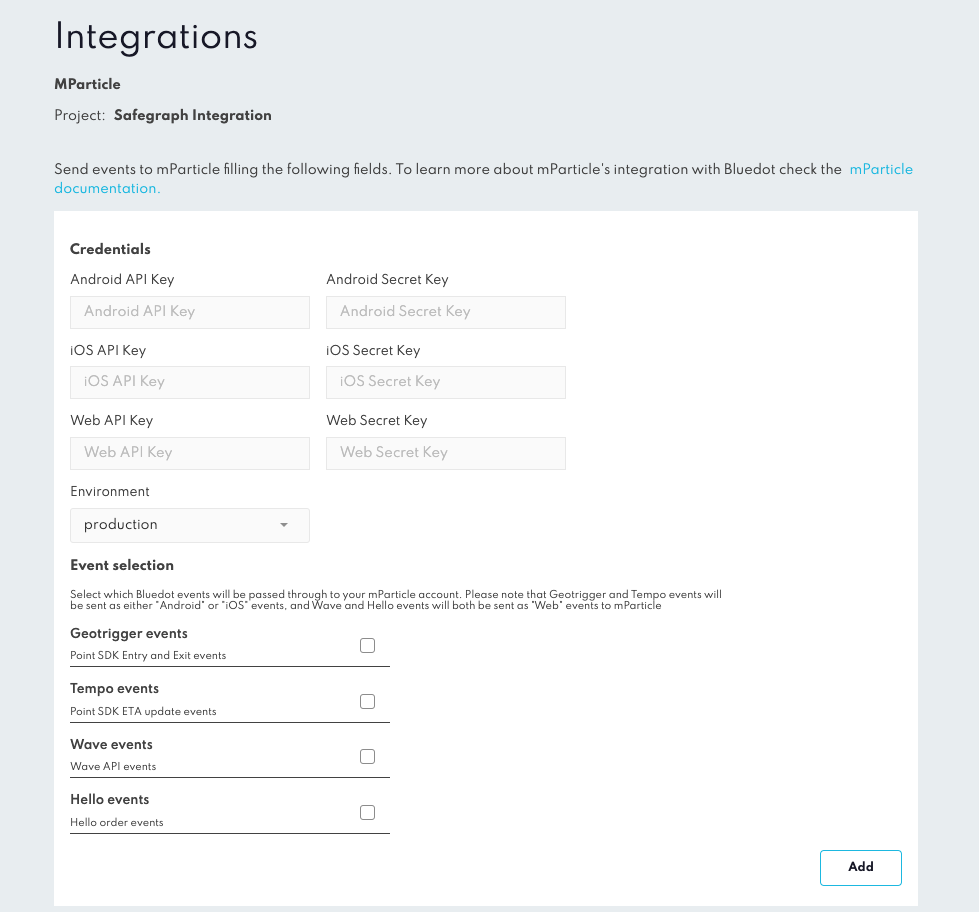

mParticle Integration
=====================

Rezolve is a location platform that provides an accurate and simple geofencing platform for apps. After integrating the Rezolve Point SDK and setting geofences, customer’s can create personalised location-based experiences for their users.

mParticle is a customer data platform that unifies customer data in one place and connects it to 175+ leading marketing, analytics, and data warehousing solutions.

Through this integration, Bluedot’s first-party, accurate, and privacy compliant location data can be connected and utilised across all of the platform and apps supported by mParticle.  

Associated Documentation
------------------------

*   mParticle’s own [_mParticle + Bluedot documentation_](https://docs.mparticle.com/integrations/bluedot/feed/)

* * *


Integration Overview
--------------------

Before you begin the integration, ensure you have an active customer account with Rezolve & mParticle. Decide on the custom data you'll be passing from Rezolve Events to mParticle:

- [Custom Event Metadata](../Custom%20Data.md) (max.20)
- Custom Zone Data (max.20)

Events type
-----------

The mParticle integration will also support the following events:

- **Geo-trigger:** Entry and/or exit into a Zone/Geofence
- **Tempo**: ETA calculations as a user moves towards a Zone
- **Wave**: API events when a user notifies of their arrival
- **Hello Orders**: Events when the state of an order has been updated in Hello Screens

To use the Geo-trigger and Tempo events, you'll need to integrate the Rezolve Point SDK within your mobile app:

- [iOS integration guide](../Point%20SDK/iOS/Overview.md)
- [Android integration guide](../Point%20SDK/Android/Overview.md)

For Wave and Hello Orders, please refer to the following:

- [Wave integration guide](../APIs/Wave%20API/Integrate%20Wave%20API.md)
- [Hello Screens documentation](../Hello%20Screens/Overview.md)

Add a Rezolve integration to your mParticle account, as mentioned in mParticle's documentation. 

Add your mParticle iOS, Android and/or Web publishable API keys and secrets to the Project via the Integrations section in Canvas.

Environments
------------

You have the option to send data to mParticle as either development or production data. When set to development, all data is treated as such and remains separate from your production data. If set to production, the data is forwarded to all configured integrations for your application. We recommend using the development setting for testing purposes. This allows you to view Rezolve events in the [Live Stream view](https://docs.mparticle.com/guides/data-master/live-stream/).



Custom Attributes / Sending events to mParticle
-----------------------------------------------

Custom attributes can be passed along to mParticle as key/ value pairs in Rezolve’s [Custom Event Metadata](../Custom%20Data.md).  
An example will be:

```json
mparticle_customer_id : "<your mparticle customer id>",
another_custom_field : "another value",
```


:::tip
At least one of `user_dentities` listed in [mParticle’s documentation](https://docs.mparticle.com/developers/server/json-reference/#user_identities) with the `mparticle_` fields **_must_** be included in the [Custom Event Metadata](../Custom%20Data.md) in order to push events to mParticle.
:::

:::info
The custom event metadata is not persisted across SDK sessions. If the SDK is logged out the custom event metadata is cleared by the SDK. We suggest setting the custom data every time the SDK is authenticated in the app.

More information on best practices of setting and using custom event metadata can be found [here](../Custom%20Data.md).
:::
