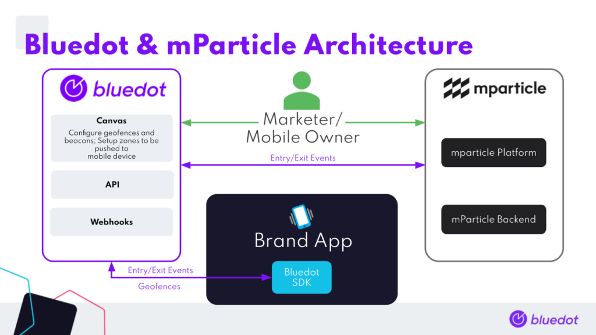
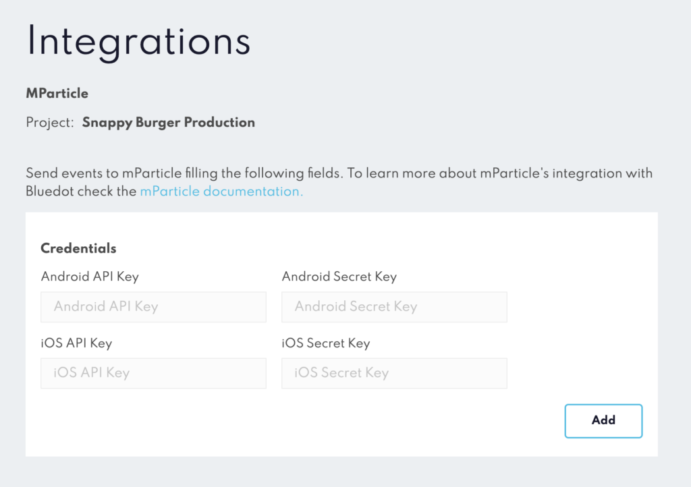

mParticle Integration
=====================

Bluedot is a location platform that provides an accurate and simple geofencing platform for apps. After integrating the Bluedot SDK and setting geofences, customer’s can create personalised location-based experiences for their users.

mParticle is a customer data platform that unifies customer data in one place and connects it to 175+ leading marketing, analytics, and data warehousing solutions.

Through this integration, Bluedot’s first-party, accurate, and privacy compliant location data can be connected and utilised across all of the platform and apps supported by mParticle.  

Associated Documentation
------------------------

*   mParticle’s own [_mParticle + Bluedot documentation_](https://docs.mparticle.com/integrations/bluedot/feed/)

* * *

Integration Architecture Diagram
--------------------------------



Integration Overview
--------------------

Before you begin the integration please ensure you have an active customer account with both Bluedot & mParticle.

1.  Decide on the custom data you’ll be passing from Bluedot Entry/Exit (_can_ _also be called Check-in and Check-out Event_) Events to mParticle:
    1.  [Custom Event Metadata](../Custom%20Event%20Metadata.md) (_max.20_)
    2.  [Custom Zone Data](../Canvas/What%20is%20Zone%20custom%20data.md) (_max.20_)
2.  Integrate the Bluedot SDK within your mobile app: 
    1.  [iOS integration guide](../Point%20SDK/iOS/Quick%20Start.md)
    2.  [Android integration guide](../Point%20SDK/Android/Quick%20Start.md)
3.  Add a Bluedot integration to your mParticle account, as laid out in [mParticle’s documentation](https://docs.mparticle.com/integrations/bluedot/feed/).
4.  Add your mParticle iOS and/or Android publishable API keys and secrets to the Project via the Integrations section in Canvas.  
      
    

Once these steps are done, the integration is ready to go. Simply enter a geofence with a mobile device to trigger the Zone.

Custom Attributes / Sending events to mParticle
-----------------------------------------------

Custom attributes can be passed along to mParticle as key/ value pairs in Bluedot’s [Custom Event Metadata](../Custom%20Event%20Metadata.md) by prepending the key with `mparticle_`.  
An example will be:

```json
mparticle_customer_id : "<your mparticle customer id>",
mparticle_another_custom_field : "another value",
```


:::warning
At least one of `user_dentities` listed in [mParticle’s documentation](https://docs.mparticle.com/developers/server/json-reference/#user_identities) with the `mparticle_` fields **_must_** be included in the CustomEventMetaData in order to push events to mParticle.
:::

:::info
The custom event metadata is not persisted across SDK sessions. If the SDK is logged out the custom event metadata is cleared by the SDK. We suggest setting the custom data every time the SDK is authenticated in the app.

More information on best practices of setting and using custom event metadata can be found [here](../Custom%20Event%20Metadata.md).
:::

Integration Fields: Type & Character Length setup
-------------------------------------------------

### **Event Custom Attributes**

| **Field**          | **TYPE** | **LENGTH** | **DESCRIPTION**                                                                   |
|--------------------|----------|------------|-----------------------------------------------------------------------------------|
| `altitude`         | Number   |            | Altitude in metres if supplied by device sensors                                  |
| `altitudeAccuracy` | Number   |            | Accuracy of supplied altitude                                                     |
| `bearing`          | Number   |            | The direction of motion of the device at the time of trigger event, if available  |
| `checkInTime`      | Datetime |            | The time of entry – only supplied for exit triggers                               |
| `eventTime`        | Datetime |            | The time of the trigger event                                                     |
| `fenceId`          | UUID     | 36         | Only available if trigger caused by geofence or Geoline™                          |
| `fenceName`        | String   |            | Only available if trigger caused by geofence or Geoline™                          |
| `id`               | UUID     | 36         | The unique ID of the trigger                                                      |
| `projectId`        | UUID     | 36         | The ID of the Bluedot project that the SDK was running against                    |
| `sdkVersion`       | String   |            | The version of the Bluedot SDK                                                    |
| `speed`            | Number   |            | The speed of the device at the time of trigger event, if available                |
| `triggerId`        | UUID     | 36         | The chain ID of the trigger, which can be used to associate entry and exit events |
| `zoneId`           | UUID     | 36         | The ID of the Bluedot Zone that the trigger was associated with                   |
| `zoneName`         | String   |            | The name of the Bluedot Zone that the trigger was associated with                 |

### **Application Info**

| **FIELD**             | **TYPE** | **LENGTH** | **DESCRIPTION**                                                                          |
|-----------------------|----------|------------|------------------------------------------------------------------------------------------|
| `application_version` | String   |            | The version of the application holding the Bluedot PointSDK on the device that triggered |
| `package`             | String   |            | The package name of the application running Bluedot Point SDK                            |

### **Device Info**

| **FIELD**      | **TYPE** | **LENGTH** | **DESCRIPTION**                                                  |
|----------------|----------|------------|------------------------------------------------------------------|
| `device_model` | String   |            | The model of device that triggered                               |
| `platform`     | String   |            | iOS or android                                                   |
| `os_version`   | String   |            | The version of the operating system on the device that triggered |

### **User Attributes**

| **FIELD**             | **TYPE** | **LENGTH** | **DESCRIPTION**                                         |
|-----------------------|----------|------------|---------------------------------------------------------|
| `bluedot_customer_id` | UUID     | 36         | A unique UUID associated with the device that triggered |

* * *

Contact Details
---------------

If you have any technical issues or questions you please use [**_help@bluedot.io_**](mailto:help@bluedot.io) to reach out to our Melbourne-based Engineering team.