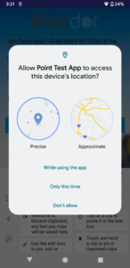

Location Permission & Notifications Best Practices
============================================================

Location permissions
--------------------

Prior to starting any Bluedot Services (Geo-triggering or Tempo), the app must request and be granted location permission. When requesting location permission it is important to make the request in context and convey the value the user will be gaining from granting the permission.

For apps targeted Android 11 and lower, only [ACCESS_FINE_LOCATION](https://developer.android.com/reference/android/Manifest.permission#ACCESS_FINE_LOCATION) permission needs to be requested and granted.

When targeting Android 12 and onwards the app must request both [approximate location](https://developer.android.com/training/location/permissions#request-location-access-runtime) and [precise location](https://developer.android.com/training/location/permissions#accuracy). The app should request [ACCESS_COARSE_LOCATION](https://developer.android.com/reference/android/Manifest.permission#ACCESS_COARSE_LOCATION) and [ACCESS_FINE_LOCATION](https://developer.android.com/reference/android/Manifest.permission#ACCESS_FINE_LOCATION).

The user may choose to grant access to either approximate or precise as shown below:



If the app has not been granted permission to access precise location data the Geo-triggering and Tempo services will not start, and the start method will return a [LocationPermissionNotGrantedError](https://android-docs.bluedot.io/-bluedot-s-d-k/au.com.bluedot.point/-location-permission-not-granted-error/index.html). To ensure the location permission has been granted, it is important to implement the permission checking and requesting process prior to any attempt to start a Bluedot service.

Additionally, from Android 10 onwards, if the Geo-triggering service is not run as a [foreground service](https://developer.android.com/guide/components/foreground-services), the `ACCESS_BACKGROUND_LOCATION` [permission must be requested](https://developer.android.com/training/location/permissions#background) and granted in order for the Geo-triggering service to access location data and function when the app is not in use. From Android 11 onwards, the request to access background location data [must be made separately](https://developer.android.com/about/versions/11/privacy/location#request-background-location-separately) from the initial request to access location data. Even when granted permission to access background location data the access is limited to only a [few updates per hour](https://developer.android.com/training/location/background#limit-updates) while the app is not in use. The Play Store also has [restrictions](https://support.google.com/googleplay/android-developer/answer/9799150) on how apps published on the store may utilise background location data.

Foreground service and persistent notification
----------------------------------------------

Given the restrictions on accessing location data from the background, it is recommended that the Geo-triggering service be run as a foreground service, and the Tempo service must be run as a foreground service. Implementing a [foreground service](https://developer.android.com/guide/components/foreground-services) is the best practice for ensuring users are fully aware of how and when their location is accessed and also for the most efficient use of system resources. When a foreground service is running, there will be a persistent notification in the notification tray informing the user that your app is accessing the device location when the app is in the foreground and background during the lifecycle of the Geo-triggering or Tempo services. Foreground services must always be started while the app is in use and in the foreground.

As per latest recommendation from [Google](https://support.google.com/googleplay/android-developer/answer/13392821?hl=en#zippy=%2Cwhat-is-a-foreground-service-permission-and-does-it-need-to-be-granted-by-the-user-before-starting-a-foreground-service%2Cwhat-is-changing-for-foreground-services-in-android%2Chow-do-i-know-what-foreground-service-type-to-use) you'll need to add the following permissions in the Android Manifest:
* When app is targeting **Android 14** and onwards and it is using foreground service Geo-trigger/Tempo then it should add a [`FOREGROUND_SERVICE_LOCATION`](https://developer.android.com/reference/android/Manifest.permission#FOREGROUND_SERVICE_LOCATION) type permission in the app manifest.

```xml title="AndroidManifest"
 // Required Android 14 onwards
 <uses-permission android:name="android.permission.FOREGROUND_SERVICE_LOCATION" />
 <uses-permission android:name="android.permission.POST_NOTIFICATIONS"/>   
```

* And if it is targeting **Android 13** onwards then for using Foreground Service implementation of Geo-Trigger/Tempo [`POST_NOTIFICATIONS`](https://developer.android.com/develop/ui/views/notifications/notification-permission) is required to be declared in app manifest as below:

```xml title="AndroidManifest"
 // Required Android 13 onwards
 <uses-permission android:name="android.permission.POST_NOTIFICATIONS"/>   
```

To run as a foreground service the [`GeoTriggerBuilder`](https://android-docs.bluedot.io/-bluedot-s-d-k/au.com.bluedot.point.net.engine/-geo-triggering-service/-geo-trigger-builder/index.html) and [`TempoBuilder`](https://android-docs.bluedot.io/-bluedot-s-d-k/au.com.bluedot.point.net.engine/-tempo-service/-tempo-builder/index.html) must be passed a [Notification](https://developer.android.com/training/notify-user/build-notification) via the `notification()` method. This is the notification that will be displayed persistently as long as the service is running. The notification should convey to the user why the app is collecting location data, and what value they are receiving from allowing the app to do so.

Please see our [Minimal Integration](https://github.com/Bluedot-Innovation/PointSDK-MinimalIntegrationExample-Android) project for examples on how to build notifications and start [Geo-triggering](https://github.com/Bluedot-Innovation/PointSDK-MinimalIntegrationExample-Android/blob/415b25f55e551718fd4525858f3db9346920f802/app/src/main/java/au/com/bluedot/minimalintegration/MainApplication.java#L93) and [Tempo](https://github.com/Bluedot-Innovation/PointSDK-MinimalIntegrationExample-Android/blob/415b25f55e551718fd4525858f3db9346920f802/app/src/main/java/au/com/bluedot/minimalintegration/MainApplication.java#L120) as foreground services.

If a notification is passed in during Geo-triggering or Tempo initialization, the notification will be displayed across all device OS versions.  To only display the notification on devices running Android Oreo and above, where it is required to access location data from the background, perform a version check when initializing the service and pass in notification only if the OS version is API level 26 or above:

```kotlin
if (Build.VERSION.SDK_INT >= Build.VERSION_CODES.O) {
     GeoTriggeringService.builder()
        .notification(notification)
        .start(this, geoTriggerError -> {
            // Call method to handle Geo-triggering initialization here.
        });
 } else {
     GeoTriggeringService.builder()
        .start(this, geoTriggerError -> {
            // Call method to handle Geo-triggering initialization here.
        });
 }
```

If your app runs another foreground service or will run the Geo-triggering service and Tempo service simultaneously, it is best practice to use the same notification ID. Using the same notification ID ensures that only a single persistent notification will be displayed for all running foreground services. The [`GeoTriggerBuilder`](https://android-docs.bluedot.io/-bluedot-s-d-k/au.com.bluedot.point.net.engine/-geo-triggering-service/-geo-trigger-builder/index.html) and [`TempoBuilder`](https://android-docs.bluedot.io/-bluedot-s-d-k/au.com.bluedot.point.net.engine/-tempo-service/-tempo-builder/index.html) expose `notificationId()` methods to set the `notification ID`, and the [`GeoTriggeringService`](https://android-docs.bluedot.io/-bluedot-s-d-k/au.com.bluedot.point.net.engine/-geo-triggering-service/index.html) and [`TempoService`](https://android-docs.bluedot.io/-bluedot-s-d-k/au.com.bluedot.point.net.engine/-tempo-service/index.html) expose the notification ID in use via `foregroundNotificationId()` methods. The notification ID may be used to [update the notification](https://developer.android.com/training/notify-user/build-notification#Updating) after starting a service. Be aware that the most recent notification used to start a service, or the last update, will be displayed as long as any foreground service is running, thus it may be necessary to update the notification when stopping service to ensure the content remains correct.

If you do not plan to use location services without a foreground service, it’s recommended that you remove the background location permission entry included in the SDK Manifest. The Bluedot SDK will continue to receive location even when the app is backgrounded without this permission so long as the foreground notification is visible. Removing this Manifest entry can help to minimise Play Store review concerns. You can do this by adding to your app’s Manifest:

```xml title="AndroidManifest"
<uses-permission
    android:name="android.permission.ACCESS_BACKGROUND_LOCATION"
    tools:node="remove"
/>
```

Services running in the background consume device resources such as battery life, CPU time and memory, potentially resulting in bad user experiences. To mitigate this problem, since the Oreo release of the Android operating system,  a number of limitations have been applied to the operation of background services. Android 12 also added new restrictions for apps targeting Android 12 (API level 31) onwards. Most significantly, there are further restrictions on the ability to start [foreground](https://developer.android.com/guide/components/foreground-services) services while running in the background, except for [a few special cases](https://developer.android.com/about/versions/12/foreground-services#cases-fgs-background-starts-allowed).
