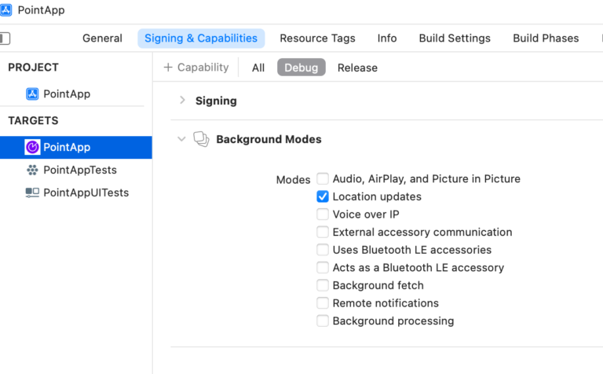

Background location access
=========================================

What is the background location usage indicator?
------------------------------------------------

The background location usage indicator (Blue Bar) is an iOS feature that allows an app to access location data when the user has selected While using the app location authorization and the app is in the background.

The background location usage indicator will be displayed as a blue pill or bar at the top of the screen – either behind the clock or across the status bar (the event display changes between iPhone models). This notification lets the user know that an app is accessing location data.


:::info
If the user has selected the _Always_ location authorization, the background location usage indicator will not be displayed.
:::

When to use the background location usage indicator?
----------------------------------------------------

Background location usage indicator should be enabled when usage requires location updates even when the App is running in background and the user has granted the _While using the app_ location authorization. 

How to set the background location usage indicator?
---------------------------------------------------

As per the [documentation](https://developer.apple.com/documentation/corelocation/getting_the_user_s_location/handling_location_events_in_the_background), enabling the background location usage indicator first requires that the app has enabled the location updates background mode:



If the location updates background mode is enabled, the background location usage indicator can be enabled and disabled by setting the `allowsBackgroundLocationUpdates` property from [CLLocationManager](https://developer.apple.com/documentation/corelocation/cllocationmanager), which is inherited by [BDLocationManager](https://ios-docs.bluedot.io/Classes/BDLocationManager.html):

  

**Enable background location usage indicator:**     

```swift
BDLocationManager.instance().allowsBackgroundLocationUpdates = true
```

For the background location usage indicator to work, `allowsBackgroundLocationUpdates` must be set to `true` while the app is in the foreground, and the app has _While using the app_ location authorization. If `allowsBackgroundLocationUpdates` is set to `true` while the app is in the background, or the user changes the location permission to _While using the app_ while the app is in the background, the background location usage indicator will not be enabled.

**Disable background location usage indicator:**

```swift
if (BDLocationManager.authorizationStatus != .authorizedAlways) {
  BDLocationManager.instance().allowsBackgroundLocationUpdates = false
}
```

The default value of `allowsBackgroundLocationUpdates` is `false`, and it can be disabled while the app is either in the foreground or the background. If the application requests _Always_ location authorization, be sure to check that _Always_ location authorization has not been granted before setting `allowsBackgroundLocationUpdates` to `false`, as setting the value to `false` will prevent the app from accessing location from the background.

Background location use cases
-----------------------------

It may be beneficial to switch the background location usage indicator on and off during app operation to maximise location data availability during mission-critical flows.

For example: 

On an app that handles ordering and pickup there may be value in starting Bluedot Geo-triggering on app start without the background location usage indicator enabled in order to power a marketing use case when the user grants _Always_ location authorization or is actively using the app. When the user places an order and there is greater necessity and value in collecting location data to maximise the likelihood the user is detected upon arrival at the collection point, the background location usage indicator should be enabled. Upon completion of the order and collection process, the background location usage indicator should be disabled, removing unauthorized background location data collection and the visible indicator.

Example steps to implement:

1.  Start Geo-triggering without background location usage indicator enabled.
2.  User places an order.
3.  Enable background location usage indicator.
4.  User travels to the pickup location.
5.  Order is completed.
6.  Disable background location usage indicator.

Migration from BDPointBackgroundLocationEnabledForWhenInUseKey  

-----------------------------------------------------------------

The Bluedot iOS SDK also supports setting the background location usage indicator at build time. Setting a `BDPointBackgroundLocationEnabledForWhenInUseKey` property in an app’s `info.plist` to `true` will cause the Bluedot SDK to set the `allowsBackgroundLocationUpdates` property setting to `true` upon start. Enabling the background location usage indicator at runtime via this method is **deprecated**, and will be removed in a future release.

If the app was previously using `BDPointBackgroundLocationEnabledForWhenInUseKey` to enable the background location usage indicator, please ensure the property is removed before using `BDLocationManager.instance().allowsBackgroundLocationUpdates`.

To migrate to the new method of enabling the background location usage indicator without a change in SDK or app functionality, simply remove the `BDPointBackgroundLocationEnabledForWhenInUseKey` property and ensure `BDLocationManager.instance().allowsBackgroundLocationUpdates` is set to `true` prior to starting Geo-triggering or Tempo.